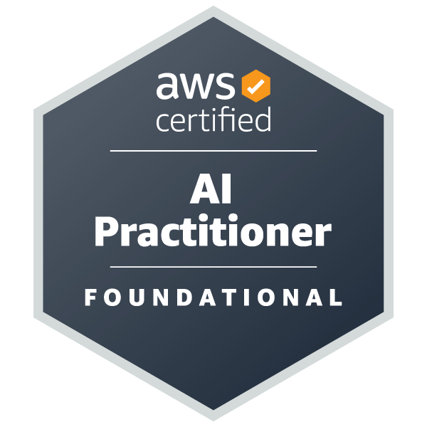

# Hi, I'm Kiril 👋
Backend Developer & IT Administrator from Poland.

💼 1+ year of professional IT experience
🚀 2 production CRM systems deployed
⚡ Python / Django / PostgreSQL
☁️ AWS Cloud
🐳 Docker
🔌 REST APIs
🎓 AWS Certified AI Practitioner

## Currently
* Improving and maintaining commercial CRM systems
* Preparing for AWS Certified Cloud Practitioner
* Looking for my next IT opportunity

## Professional Experience
* IT Administrator at YURT GROUP Sp. z o.o.
* Developed and deployed a production CRM system for an immigration office
* Developed and deployed a commercial CRM system for a poultry processing company

## Certifications

## Featured Projects
### Biuro Granica CRM
Production CRM used by an immigration office to manage clients, cases and payments.

### Poultry Company CRM
Production CRM used by a poultry processing company to manage employees, contracts, payments and reports.

### Helpdesk SaaS
Ticket management platform with authentication, roles and REST API.

### AWS File Upload API
Secure file upload service using AWS S3, signed URLs and Docker.

## Links
🌐 kiril.pl
📧 [kiril@kiril.pl](mailto:kiril@kiril.pl)
💼 LinkedIn
